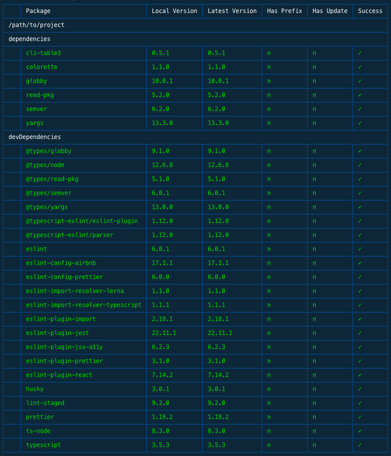

# @mitchellsimoens/versionator

[](https://www.npmjs.com/package/@mitchellsimoens/versionator)
[](https://www.npmjs.com/package/@mitchellsimoens/versionator)
[](https://github.com/mitchellsimoens/versionator/actions?query=workflow%3ATest)
[](http://makeapullrequest.com)
[](./LICENSE)

Allows checking locally installed node modules for updates against [npm](https://www.npmjs.com/) repository. This also can enforce dependencies to be unprefixed for security reasons.

## Installation

```shell
# with npm
npm install -g @mitchellsimoens/versionator

# or with yarn
yarn global add @mitchellsimoens/versionator
```

## Usage

From the project you want to check, run:

```shell
versionator
```

This will look for all `package.json` files under the current directory and check for any updates and prefixed versions (excluding the `package.json` files under `node_modules`). If a module has an update or is using a prefixed version, the process will exit with code `1` and the associated row in the rendered table will be red.

You can disable the prefix version checking:

```shell
versionator --allow-prefixed
```

You can disable the nested `package.json` lookup and only look at the `package.json` in the current directory:

```shell
versionator --shallow
```

If you need to exclude a path, you can provide the `--exclude` as a glob relative to the current directory:

```shell
versionator --exclude "examples/**/package.json"
```

If you want to allow certain levels of updates, you can use the `--allow-update` to specify the highest difference:

```shell
versionator --allow-update patch
```

The values can be: major, ≈, minor, preminor, patch, prepatch, prerelease. Reminder, npm uses [semver](https://semver.org/).

## Programmatic Execution

While you will likely only use the cli means of this, you can programmatically execute this. When you do so, the table will not render, the array of reports will be returned.

```typescript
import versionator, { Report } from '@mitchellsimoens/versionator';

(async (): Promise<void> => {
  const reports: Report[] = await versionator();
})();
```

You can also pass the options to the `versionator` function:

```typescript
import versionator, { Report } from '@mitchellsimoens/versionator';

(async (): Promise<void> => {
  const reports: Report[] = await versionator({
    'allow-prefixed': true,
    exclude: 'examples/{foo,bar}/package.json',
    shallow: true,
  });
})();
```

## Sample

<center></center>
